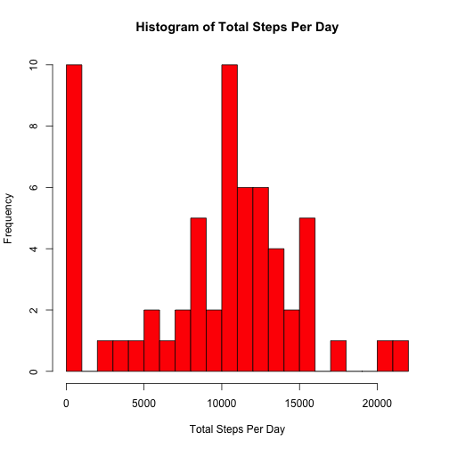

# Reproducible Research: Peer Assessment 1
===========================================

This project is an analysis of two months of exercise data,
obtained during October and November of 2012. 

## Loading and Preprocessing Data

The following code makes sure that the "activity.csv" file 
is present in the current working directory. The file is
unzipped from "activity.zip". 


```r
if(!file.exists("activity.csv")) {
      unzip("./activity.zip")
      if(!file.exists("activity.csv")) {
           message("source data can't be downloaded")
        }
}
```

To load the file into R, use the read.csv command. 


```r
activityData <- read.csv("activity.csv", header = TRUE)
str(activityData)
```

```
## 'data.frame':	17568 obs. of  3 variables:
##  $ steps   : int  NA NA NA NA NA NA NA NA NA NA ...
##  $ date    : Factor w/ 61 levels "2012-10-01","2012-10-02",..: 1 1 1 1 1 1 1 1 1 1 ...
##  $ interval: int  0 5 10 15 20 25 30 35 40 45 ...
```

As the str(activityData) command shows, the structure of the 
activityData data frame is three columns: steps, date, interval. 

There are "NA" or missing values present in the data. 
The date column has been read in as factors. To make
processing easier, we will gather the different dates 
into a vector: 


```r
dateVector <- levels(activityData$date)
str(dateVector)
```

```
##  chr [1:61] "2012-10-01" "2012-10-02" "2012-10-03" ...
```

The "date" information has been read in as factors.
To make analysis possible we need to convert the dates
to R date format. 


```r
dateVector <- as.Date(dateVector, format = "%Y-%m-%d")
activityData$date <- as.Date(activityData$date, format = "%Y-%m-%d")
```


## Mean Steps Per Day (ignoring missing data)

The following code computes a vector containing the number of
steps per day. 


```r
total_day <- sapply(dateVector, function(i) {
             total_day <- numeric()
             x_sub <- subset(activityData, date == i)
             sum_sub <- sum(x_sub$steps, na.rm=TRUE)
             total_day <- c(total_day, sum_sub)
}
)
```

The following code plots a histogram of total day steps: 

```r
hist(total_day, breaks = 22
     , main = "Histogram of Total Steps Per Day"
     , col ="red"
     , xlab = "Total Steps Per Day")
```

 

And the mean and median are computed as follows: 


```r
mean_total_steps <- mean(total_day)
median_total_steps <- median(total_day)
```

* The mean total steps per day is: 9354.2295.
* The median total steps per day is: 1.0395 &times; 10<sup>4</sup>.

## Average Daily Activity

We'd like to compute the average number of steps at each 5 minute interval and plot these averages. 


```r
stepMatrix <- matrix (nrow = 288, ncol = length(dateVector))
for (i in 1:length(dateVector)) {
        begin <- 288*(i-1) + 1
        end <- 288*i
        stepMatrix[,i] <- activityData$steps[begin:end]      
}
stepsIntervals <- 1:288
for (i in 1:288) {
        stepsIntervals[i] <- mean(stepMatrix[i,], na.rm = TRUE)
}
```

To plot the averages over the course of a day: 


```r
x_values <- activityData$interval[1:288]
plot(x_values, stepsIntervals
     , main = "Average Steps at Daily 5-Minute Intervals"
     , xlab = "Time Interval"
     , ylab = "Average Steps"
     , type = "l")
```

 

To determine the time at which the maximum average number of steps occurs: 


```r
maxSteps <- max(stepsIntervals)
testMax <- stepsIntervals == maxSteps
indexMax <- which(testMax)
timeMax <- activityData$interval[indexMax]
```

The time when the maximum occurs is 835. 

## Inputting Missing Values

## Activity Levels: Weekday Vs. Weekend


